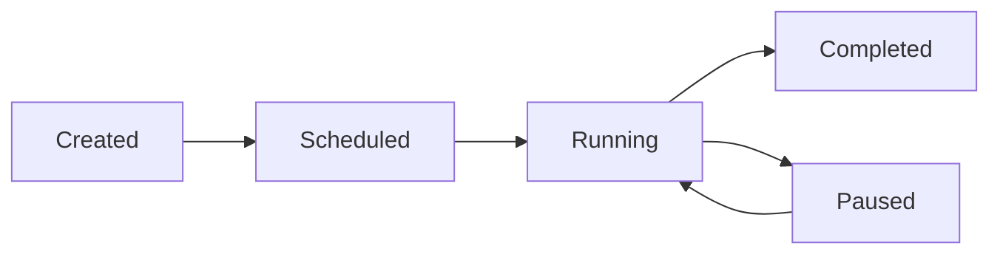

# Campaign

Campaigns let you automate outbound calls at scale. Upload a contact list, assign an agent, set a schedule, and let Callem Studio handle the rest — calling each contact, tracking outcomes, and reporting results in real-time.

## Creating a Campaign

<Steps>
  <Step title="Navigate to Campaign">
    Go to **Deploy > Campaign** and click **New Campaign**.
  </Step>
  <Step title="Configure settings">
    Fill in the campaign configuration (see settings table below).
  </Step>
  <Step title="Upload contacts">
    Upload a CSV file with phone numbers and optional personalization data.
  </Step>
  <Step title="Review and launch">
    Review the settings and start the campaign immediately or schedule it for later.
  </Step>
</Steps>

### Campaign Settings

| Setting | Description | Tips |
|---------|-------------|------|
| **Name** | Campaign identifier | Use descriptive names like "Q1 Lead Follow-up" or "Appointment Reminders March" |
| **Agent** | The voice agent that will handle all calls | Make sure the agent's prompt is adapted for outbound calls (the agent is calling, not being called) |
| **Contact list** | Phone numbers to call (CSV upload) | See format below |
| **Caller ID** | The phone number displayed to contacts | Use a number your contacts will recognize to improve answer rates |
| **Schedule** | When to start/stop calling | Respect calling hours for your contacts' timezone |
| **Concurrency** | Maximum simultaneous calls | Start low (3-5) and increase based on agent performance |
| **Retry logic** | How many times to retry unanswered calls | 2-3 retries with increasing intervals is standard |

## Contact List Format

Upload your contacts as a CSV file. The only required column is a phone number. Additional columns can be used as dynamic variables in your agent's prompt.

```csv Example CSV
phone,name,company,appointment_date
+33612345678,Marie Dupont,Acme Corp,2025-03-15
+33698765432,Jean Martin,TechStart,2025-03-16
+33611223344,Sophie Bernard,DataFlow,2025-03-17
```

### Dynamic Variables

Reference CSV columns in your agent's system prompt using `{{column_name}}` syntax:

```text Example Prompt
You are calling {{name}} from {{company}} to remind them about their
appointment on {{appointment_date}}. Be friendly and professional.
If they want to reschedule, use the reschedule_appointment tool.
```

<Tip>
  Campaigns with personalized greetings (using the contact's name and context) see significantly higher engagement rates. Always include at least the contact's name in your CSV.
</Tip>

## Campaign Lifecycle



| Status | Description |
|--------|-------------|
| **Created** | Campaign is configured but not started |
| **Scheduled** | Waiting for the scheduled start time |
| **Running** | Actively placing calls to contacts |
| **Paused** | Temporarily stopped — can be resumed at any time |
| **Completed** | All contacts have been called (including retries) |

## Monitoring Progress

While a campaign is running, the dashboard shows real-time metrics:

| Metric | Description |
|--------|-------------|
| **Total contacts** | Size of the contact list |
| **Called** | Number of contacts already called |
| **Remaining** | Contacts not yet called |
| **Success rate** | Percentage of engaged calls vs. total attempts |
| **Average call duration** | Mean duration of completed calls |
| **Retry queue** | Number of contacts pending retry |
| **Active calls** | Currently active concurrent calls |

## Best Practices

<AccordionGroup>
  <Accordion title="Start with a small test batch">
    Run your campaign on 10-20 contacts first. Review the call transcripts and outcomes before scaling up. Listen for issues with the opening script, tool integrations, and call flow.
  </Accordion>
  <Accordion title="Respect calling hours">
    Use the schedule settings to ensure calls are only placed during appropriate hours for your contacts' timezone. Calling too early or too late damages your brand and may violate regulations.
  </Accordion>
  <Accordion title="Adapt your agent prompt for outbound">
    Outbound prompts are different from inbound. The agent is initiating the call, so it should introduce itself, state the purpose, and ask for permission to continue. Example: "Hello {{name}}, this is Sophie from Acme Dental calling about your appointment next week."
  </Accordion>
  <Accordion title="Monitor the first few minutes">
    Watch the campaign dashboard during the initial calls. If something is wrong with the agent configuration or the contact list, you can pause immediately before calling your entire list.
  </Accordion>
  <Accordion title="Use low concurrency at first">
    Start with 3-5 simultaneous calls and increase gradually. This gives you time to identify issues without affecting too many contacts.
  </Accordion>
</AccordionGroup>
