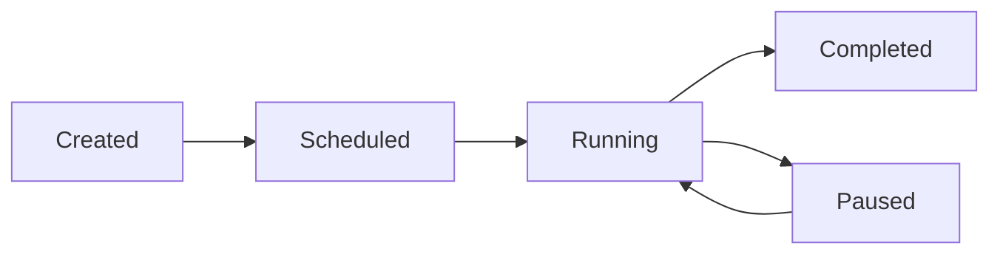

# Campaign

Campaigns let you automate outbound calls at scale. Upload a contact list, assign an agent, set a schedule, and let Callem Studio handle the rest — calling each contact, tracking outcomes, and reporting results.

## Creating a Campaign

1. Navigate to **Deploy > Campaign**
2. Click **New Campaign**
3. Configure the campaign settings

### Campaign Settings

| Setting | Description |
|---------|-------------|
| **Name** | Campaign identifier |
| **Agent** | The voice agent that will handle all calls |
| **Contact list** | Phone numbers to call (CSV upload or manual entry) |
| **Caller ID** | The phone number displayed to contacts |
| **Schedule** | When to start/stop calling (date, time, timezone) |
| **Concurrency** | Maximum simultaneous calls |
| **Retry logic** | How many times to retry unanswered calls |

## Contact List

Upload your contacts as a CSV file with at least a phone number column. Additional columns can be mapped to dynamic variables in your agent's prompt.

```csv Example CSV
phone,name,company
+33612345678,Marie Dupont,Acme Corp
+33698765432,Jean Martin,TechStart
+33611223344,Sophie Bernard,DataFlow
```

<Tip>
  Use dynamic variables in your agent's system prompt (e.g. `{{name}}`, `{{company}}`) to personalize each call based on the contact's data.
</Tip>

## Campaign Lifecycle



- **Created**: campaign is configured but not started
- **Scheduled**: waiting for the start time
- **Running**: actively placing calls
- **Paused**: temporarily stopped (can be resumed)
- **Completed**: all contacts have been called

## Monitoring Progress

While a campaign is running, the dashboard shows:

- **Total contacts** vs **called** vs **remaining**
- **Success rate** (engaged calls vs total)
- **Average call duration**
- **Retry queue** size
- Real-time call activity

## Best Practices

<AccordionGroup>
  <Accordion title="Start with a small test batch">
    Run your campaign on 10-20 contacts first. Review the call transcripts and outcomes before scaling up.
  </Accordion>
  <Accordion title="Respect calling hours">
    Use the schedule settings to ensure calls are only placed during appropriate hours for your contacts' timezone.
  </Accordion>
  <Accordion title="Personalize when possible">
    Campaigns with personalized greetings (using the contact's name) see significantly higher engagement rates.
  </Accordion>
  <Accordion title="Monitor in real-time">
    Keep an eye on the campaign dashboard during the first few minutes. If something is wrong with the agent or the contact list, you can pause immediately.
  </Accordion>
</AccordionGroup>
